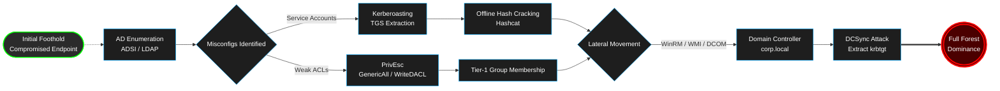

# 🔴 Advanced Active Directory Red Teaming & CRTP Notes


## 🔬 Enterprise Attack Simulation (Personal Home Lab)

> **Self-Hosted Cyber Range:** To truly understand Active Directory beyond just theoretical attacks, I built this entire infrastructure completely from scratch on a dedicated local machine. Every router, server, endpoint, and firewall rule was manually provisioned and configured to mimic a segmented, real-world enterprise environment.

### 🏗️ Infrastructure Architecture (Built from Scratch)
* **Hypervisor & Networking:** Engineered a virtualized environment utilizing custom internal networks and isolated subnets.
* **Network Boundary:** Manually deployed and configured a **pfSense** firewall to handle NAT, internal routing, and simulate corporate network segmentation (VLANs).
* **Domain Controller:** `corp.local` (Windows Server 2022) - Manually promoted to a DC, populated with custom organizational units (OUs), Group Policies (GPOs), and realistic service accounts.
* **Endpoints:** 2x Windows 10 Workstations - Joined to the domain with Windows Defender actively running to test real-world evasion techniques.

### ⚔️ Execution Flow (The Kill Chain)
1. **Initial Foothold:** Assumed breach scenario starting with a compromised low-privileged domain user on a Windows 10 endpoint.
2. **Reconnaissance:** Executed stealthy ADSI/.NET enumeration to map trust boundaries, SPNs, and privileged groups without triggering massive LDAP anomaly alerts.
3. **Credential Access:** Performed a targeted Kerberoasting attack against specific service accounts. Hashes were extracted and cracked offline.
4. **Privilege Escalation:** Identified and abused a misconfigured ACL (`GenericAll` / `WriteDACL`) to elevate privileges to a Tier-1 administrative group.
5. **Lateral Movement:** Utilized WinRM and WMI (Living off the Land) to pivot across the network to the Domain Controller without dropping malicious binaries.
6. **Domain Dominance:** Coerced DC authentication, extracted the `krbtgt` hash via DCSync, and established persistence.

### 🛡️ Detection & SOC Telemetry (Blue Team Notes)
* **Event ID 4769:** Monitored for suspicious Ticket Granting Service (TGS) requests (Kerberoasting activity).
* **Event ID 4624 / 4625:** Tracked authentication anomalies and Logon Type 3 network logons during lateral movement.
* **Event ID 4688:** Correlated process creation logs to identify malicious PowerShell/WMI spawning.

### 🗺️ Attack Flow (Kill Chain)



-------------------------------------------------
## 📚 Detailed Notes
A comprehensive, OPSEC-focused repository detailing advanced Active Directory exploitation techniques, lateral movement strategies, and domain dominance paths. These notes were compiled during the preparation for the **Certified Red Team Professional (CRTP)** examination and have been upgraded to reflect modern EDR-evasion and Living off the Land (LotL) methodologies.

## 🎯 Repository Philosophy

Unlike standard cheat sheets that rely heavily on dropping noisy binaries (e.g., standard `Mimikatz`, `PsExec`) and triggering massive EDR telemetry, this repository focuses on:
* **Living off the Land (LotL):** Utilizing native Windows APIs, ADSI, and PowerShell to blend in with legitimate administrative traffic.
* **In-Memory Execution:** Completely fileless payload execution to bypass traditional AV scanning.
* **OPSEC Awareness:** Prioritizing AES-256 over RC4, avoiding Event ID 4688 (Process Creation) anomalies, and executing targeted enumeration rather than noisy domain-wide scans.

## 📂 Repository Structure

```text
crtp-notes/
├── README.md
└── AD-Cheatsheet/
    ├── 01-Enumeration.md          # Stealth ADSI, PowerView, BloodHound OPSEC
    ├── 02-Lateral-Movement.md     # DCOM, WinRM, WMI, Pass-the-Ticket
    ├── 03-Privilege-Escalation.md # LPE, ACL Abuse, Constrained/Unconstrained Delegation
    ├── 04-Kerberos-Attacks.md     # Targeted Roasting, Native .NET TGS Requests
    └── 05-Persistence.md          # Diamond/Golden Tickets (AES), DSRM, SDProp
```

## 🛠️ Core Toolkit Referenced

- **Native Windows:** `ADSI`, `WMI`, `DCOM`, `WinRM`
    
- **C2 & Memory:** `PowerView` (Heavily modified/In-memory), `Rubeus`
    
- **Analysis:** `BloodHound` / `SharpHound` (Targeted Collection)
    
- **Execution:** `.NET Reflection`, `API Unhooking Concepts`
    

## ⚠️ Disclaimer

> **For Educational and Authorized Testing Purposes Only.**
> 
> All techniques, scripts, and commands provided in this repository are intended strictly for use in closed laboratory environments or during authorized penetration testing / Red Team engagements where explicit written consent has been granted by the infrastructure owner. The author assumes no liability and is not responsible for any misuse or damage caused by the information provided.

## 📚 Acknowledgments

- Massive respect to [Altered Security](https://www.alteredsecurity.com/) for the exceptional **CRTP (Certified Red Team Professional)** boot camp and lab environment.
    
- Inspiration drawn from the global InfoSec community, BloodHound Gang, and various open-source Red Team developers.
    

---

_Stay stealthy. Enumerate deeply. Exploit logically._
